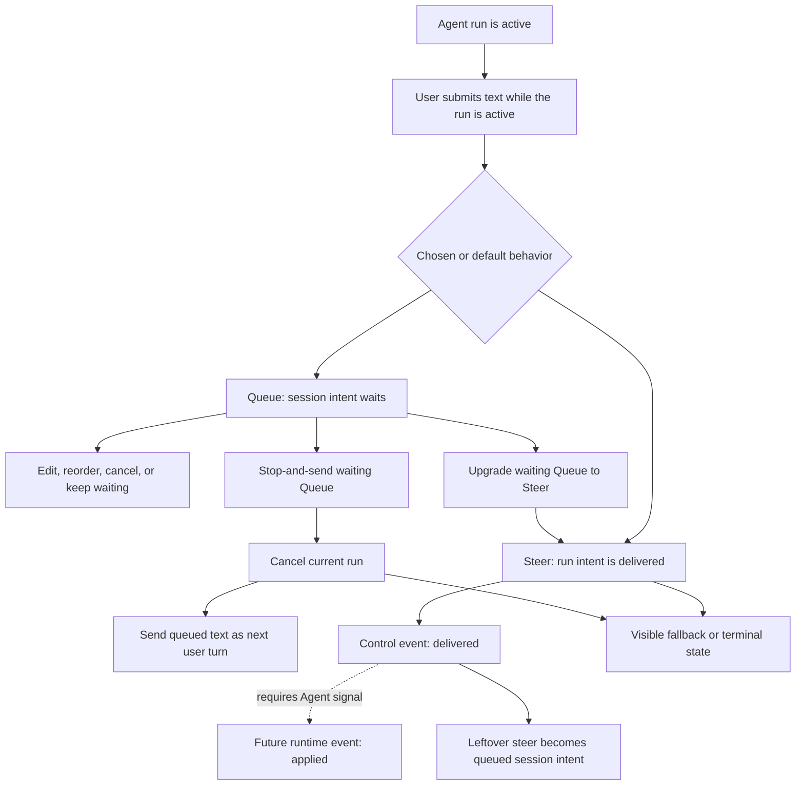

# RFC: WebUI Pending Intent Controls

- **Status:** Proposed
- **Author:** @franksong2702
- **Created:** 2026-05-28
- **Tracking issue:** [#3058](https://github.com/nesquena/hermes-webui/issues/3058)
- **Parent RFC:** [`live-to-final-assistant-replies.md`](live-to-final-assistant-replies.md) / [#3400](https://github.com/nesquena/hermes-webui/issues/3400)
- **Related issues:** [#2555](https://github.com/nesquena/hermes-webui/issues/2555), [NousResearch/hermes-agent#28172](https://github.com/NousResearch/hermes-agent/issues/28172)
- **Related docs:** [`webui-run-state-consistency-contract.md`](webui-run-state-consistency-contract.md), [`hermes-run-adapter-contract.md`](hermes-run-adapter-contract.md), [`turn-journal.md`](turn-journal.md)

## Relationship To Long-Running Sessions

This RFC is a control-surface companion to
[`live-to-final-assistant-replies.md`](live-to-final-assistant-replies.md).
That parent RFC defines how a long-running assistant turn should move from live
work to a final or terminal outcome. This RFC defines what happens when the user
intervenes while that long-running turn is still active.
It is the dedicated public control-surface contract for the parent RFC's
live-session control slice.

Long-running sessions make the problem visible because they create enough time
for the user to change their mind, add a follow-up, correct direction, or stop
the current run. Those actions must not be treated as disposable browser state:
they are user intent applied to either the owning session or the active run.

The boundary is:

- the live-to-final RFC owns assistant reply rendering, tool activity, recovery,
  and terminal outcome semantics;
- this RFC owns Queue, Steer, Stop-and-send, Interrupt, and leftover-steer
  semantics;
- both contracts share the same invariants for session ownership, replay,
  reconnect, and terminal state honesty.

## Problem

Hermes WebUI currently lets the user choose what happens when they send a
message while an agent run is active: queue, interrupt, or steer. That is a
critical long-running-session interaction, but today the settings surface and
state model describe three separate modes instead of one coherent user-intent
contract.

The most visible failure is `steer`: a successful steer is delivered through
`POST /api/chat/steer` and shown with a transient browser-only indicator. That
indicator is not part of the session transcript, not part of the run journal,
and not a durable pending item. If the user switches sessions and comes back,
or if the active pane re-renders from the server session, the visible evidence
that the user sent the steer can disappear.

Queue and interrupt have related ambiguity. Queue is session-scoped and partly
persisted in browser `sessionStorage`, but older manual testing still describes
session switching as "clearing" the queue. Interrupt is implemented as
queue-then-cancel, which is practical, but the user-facing intent is different
from an ordinary queued follow-up. Leftover steer text may also be converted to
queue after a run ends, which makes sense only if the product explains that
transition.

The current Settings wording reinforces the old model. The setting is named
`Busy input mode`, offers three values (`Queue follow-up`, `Interrupt current
turn`, `Steer (mid-turn correction)`), and describes the choice as "what
happens when you send a message while the agent is running." The proposed model
changes that product contract: Settings should choose the default waiting mode
for a new pending message, not whether the send action is permanently Queue,
Interrupt, or Steer.

The missing product primitive is a durable running-message submission model.
When the user sends while the agent is running, WebUI should not treat Queue,
Steer, and Interrupt as three unrelated permanent settings. Settings should
choose the default behavior for a new running-time message:

- Queue creates a pending message that waits for the current agent run to
  finish.
- Steer immediately delivers guidance to the active agent so it can be consumed
  in the agent's next processing window.

Queue and Steer are not mutually reversible after submission. A queued message
may be upgraded to Steer while it is still waiting, but that action is
irreversible because the message has been delivered to the active run. Once a
message has been sent as Steer, it cannot be turned back into Queue or
withdrawn. If the user presses Stop while a Queue message is still waiting, Stop
should cancel the currently running agent turn and immediately send that queued
message as the next user turn. In other words, Interrupt is not necessarily a
default message mode; it is the Stop-driven promotion of a waiting Queue message
into "stop the old run and process this now."

## Goals

- Define the user-intervention control plane for long-running agent sessions.
- Define the user semantics for running-time messages that either wait as Queue
  or deliver immediately as Steer.
- Make the state ownership explicit: which inputs belong to the session, which
  belong to the active run, and which can transition between the two.
- Make it explicit that Queue can upgrade to Steer while waiting, but Steer
  cannot be recalled or converted back into Queue after delivery.
- Define Stop on a waiting Queue message as the action that cancels the current
  run and sends that queued message immediately.
- Ensure session switching, browser refresh, SSE reconnect, and settled
  re-render do not make accepted user intent disappear.
- Separate what WebUI can prove now (`delivered`) from what requires Hermes
  Agent runtime support (`applied`).
- Give implementation PRs a small acceptance checklist for pending-input
  behavior without requiring one large scheduler rewrite.
- Preserve Hermes CLI parity where steer injects a mid-turn correction instead
  of starting a new user turn.

## Non-goals

- Do not implement the feature in this RFC.
- Do not redesign the whole composer or settings UI.
- Do not introduce a new runner, scheduler, or long-lived server queue.
- Do not make steer a normal user message when it was accepted as a mid-turn
  correction.
- Do not redefine live-to-final assistant reply rendering, tool activity,
  compression visibility, or no-final terminal classification; those belong to
  the parent long-running-session RFC.
- Do not decide final storage schema for a future run adapter. This RFC defines
  product semantics and minimum durability expectations.

## Product Principle

When the agent is running, user input is not disposable UI state. It is a
pending message against a specific session and, sometimes, a specific active
run.

The WebUI may present that intent as a chip, inline control row, timeline event,
or queued draft, but it must not rely only on a toast, a transient DOM node, or
the current browser route.

A Codex-like experience should satisfy three properties:

1. **Visible:** the user can see what they submitted and what will happen to it.
2. **Scoped:** the input cannot accidentally apply to another session after a
   session switch.
3. **Recoverable:** refresh, reconnect, or session re-render can restore either
   the intent or a clear terminal explanation.

## Settings Semantics

### Current behavior

Current Settings expose:

- label: `Busy input mode`,
- values:
  - `Queue follow-up`,
  - `Interrupt current turn`,
  - `Steer (mid-turn correction)`,
- description: Queue waits, Interrupt cancels and starts fresh, Steer injects a
  mid-turn correction without interrupting.

That wording makes Queue, Interrupt, and Steer look like three mutually
exclusive send behaviors. It also makes Interrupt a persistent default mode,
even though the intended Codex-like interaction is that interrupt happens when
the user escalates a waiting message by pressing Stop.

### Proposed behavior

Settings should instead choose the default behavior for new messages sent while
the agent is running:

- label: `While agent is running`,
- values:
  - `Queue by default`,
  - `Steer by default`,
- description: New messages sent while the agent is running either queue until
  the current run finishes, or are delivered as Steer guidance to the active
  run. A waiting Queue message can be upgraded to Steer, but that action cannot
  be undone. Pressing Stop while a queued message is still waiting cancels the
  current run and sends that queued message immediately.

Under this model, Interrupt is no longer a normal default in Settings. It is the
Stop-driven action applied to an existing pending message.

Compatibility note: users who previously selected `interrupt` need an explicit
migration decision. Reasonable options are to migrate them to `queue` and show
the new stop-and-send affordance, or keep a temporary hidden/legacy setting
until the UI transition is complete. The implementation PR should choose one and
document it.

## Terminology

| Term | Meaning |
|---|---|
| Pending message | A queued user input that has been accepted by WebUI but has not yet been sent as a normal user turn. |
| Running-message behavior | The default handling for a message sent while the agent is running: queue or steer. |
| Session intent | Pending input that should become a future user turn in the same session. |
| Run intent | Pending input that should affect the currently active run without creating a new user turn. |
| Control event | A visible timeline record for non-message input such as steer, cancel, or interrupt. |
| Stop-and-send | User action that cancels the current run and sends a waiting Queue message immediately. |
| Leftover steer | A steer accepted for a run but not consumed before the run completed. |

## Unified Pending Message Semantics

The Codex-like interaction model should be:

1. User sends a message while the agent is running.
2. WebUI chooses the behavior from Settings or the user's explicit send action.
3. If the behavior is Queue, WebUI creates one visible pending message in the
   current session.
4. If the behavior is Steer, WebUI delivers the message immediately to the
   active agent and records a visible control event.
5. While a Queue message is still waiting, the user may upgrade it to Steer.
   After that delivery, it cannot be converted back into Queue.
6. While a Queue message is still waiting, the user may press Stop to cancel the
   current run and send the queued message immediately.
7. Once processed, the running-time message becomes either:
   - an ordinary user turn,
   - a run control event,
   - a visible terminal failure/fallback,
   - or a leftover queued message with source metadata.

This keeps the mental model simple: the user wrote one message. Queue waits
until the current agent finishes; Steer is delivered to the active agent right
away; a queued message can still become Steer, but that delivery is irreversible;
Stop can promote a waiting Queue message into "cancel current run and run this
now."

## Waiting Modes

### Queue

Queue means: "send this after the current run finishes."

Expected behavior:

- The pending message is a session intent attached to the current session.
- The current run continues uninterrupted.
- The user can see, edit, reorder, merge, cancel, upgrade to Steer, or
  stop-and-send queued inputs where the UI supports those controls.
- Switching to another session hides that session's queue but does not delete it.
- Returning to the original session restores the queue display.
- The queued input must not send into a different session.
- When drained, it becomes an ordinary user turn and leaves the pending queue.

### Interrupt

Interrupt means: "stop the current run and start from this queued message."

Interrupt is a derived action, not necessarily a default waiting mode. In the
Codex-like flow, Queue is the waiting state. If the user hits Stop while a Queue
message is still waiting, WebUI promotes it to interrupt: cancel the currently
running turn, then send the queued message immediately.

Expected behavior:

- The waiting Queue message is marked as a stop-and-send replacement intent.
- WebUI asks the active run to cancel.
- The UI shows that a restart is pending or in progress.
- If cancellation succeeds, WebUI sends the replacement input as the next user
  turn in the same session.
- If cancellation fails or the stream is already gone, WebUI either sends the
  replacement when the session is safe to send or leaves a visible recoverable
  pending state.
- Refresh or session switch during cancel must not drop the replacement input.

Implementation may continue to use queue-then-cancel internally, but the
contract should treat interrupt as a distinct user intent because the expected
outcome is different from "wait your turn."

### Steer

Steer means: "apply this correction to the current run without interrupting it."

Expected behavior:

- If an active steer-capable agent accepts the message, the message is delivered
  immediately as a run intent attached to the active stream/run.
- The agent should see it in the next processing window where steer can be
  consumed.
- The transcript should show a quiet control event inside or adjacent to the
  active assistant turn, for example `Steer: use the narrower scope`.
- The control event must survive session switching, pane re-render, and replay.
- The accepted steer should move to a clear terminal state:
  - `accepted` / `delivered` when WebUI has passed it to the active agent,
  - `applied` when the runtime can prove it was consumed,
  - `leftover queued` when the run ended before consumption and WebUI converted
    it into a future session intent,
  - `failed` / `fallback` when WebUI could not steer and chose another mode.
- A successful steer must not also create a normal user message unless it later
  becomes leftover queue.
- A successful steer is no longer a pending Queue item and cannot be converted
  back into Queue or withdrawn.
- A failed steer may fall back to interrupt or queue, but the UI should explain
  the fallback and preserve the text.

## Mode Selection And Escalation

Queue and Steer are selected before submission, or while a Queue message is
still waiting. They are not reversible states for a delivered message.

Examples:

- If Settings default to Queue, the composer affordance may offer `Steer` /
  `引导` as the alternate send action.
- If Settings default to Steer, the composer affordance may offer `Queue` as the
  alternate send action before the message is submitted.
- A waiting Queue message may be upgraded to Steer if the original run is still
  active and steer is available.
- Once WebUI accepts a Steer submission, the text has been delivered to the
  active run and cannot become Queue again.
- A waiting Queue message can become stop-and-send if the user presses Stop
  before it drains.
- Once cancel has been requested, conversion may be disabled or limited because
  the side effect has already begun.
- Once steer is delivered to the agent, it is no longer an editable pending
  message; it becomes a run control event.

The UI can still make the pre-submit choice lightweight, but the state model
must not imply that a delivered Steer and a waiting Queue are freely
interchangeable.

## State Ownership

| Intent type | Owner | Durable/replay expectation |
|---|---|---|
| Queue message | Session | Stored with text, attachments, model/profile metadata, and creation time until drained, cancelled, edited, upgraded to Steer, or promoted to stop-and-send. |
| Steer message | Active run | Delivered immediately as a run control event and replayable with the active turn. |
| Stop-and-send / interrupt | Session plus active run | Promotes a waiting Queue message to a replacement input; cancel/control status is run-scoped once cancellation starts. |
| Leftover steer | Session | Converts from run intent to session intent with source metadata. |

This RFC does not require one final storage backend. A first implementation may
reuse existing browser queue state plus run-journal events, but it must name the
source of truth for each state and test the recovery behavior it claims.

Durability should be staged honestly:

- First slice: browser-backed pending Queue state may continue to use the
  existing session-scoped queue plus `sessionStorage`, as long as it has
  session-ownership and recovery tests.
- Later slice: if stronger guarantees are needed, move pending messages into
  server/session-sidecar state or another durable WebUI store.
- Steer visibility can become replayable by writing a WebUI-owned run
  control event for `delivered`, without waiting for a server-side queue.

## Steer Traceability Boundary

WebUI can own a replayable `delivered` state today: `/api/chat/steer` accepted
the steer text and passed it to the active agent. That is enough for the UI to
show a persistent "steer delivered" control event.

WebUI cannot currently prove `applied` as a distinct fact. True "the runtime
consumed this steer here" traceability depends on Hermes Agent emitting or
persisting steer metadata. That upstream boundary is tracked in
[NousResearch/hermes-agent#28172](https://github.com/NousResearch/hermes-agent/issues/28172),
with the WebUI mirror/follow-up tracked in
[#2555](https://github.com/nesquena/hermes-webui/issues/2555).

Until that agent-side signal exists, implementation PRs should use `delivered`
wording for WebUI-owned events and reserve `applied` for a future runtime-backed
state.

First-slice storage direction: successful Steer should be recorded as a
replayable run control event for `delivered`. A session-sidecar mirror is not
required for the first runtime slice unless the implementation needs it for
settled-history indexing or non-active-session markers. If that mirror is added,
the run control event remains the source of truth for active-turn replay.

## Visible Timeline Contract

Pending intents should be quiet but visible.

- Before a Queue message is dispatched, it should appear as a
  composer-attached pending-message card rather than a settled transcript bubble.
- The card sits above or attached to the composer so it reads as "this message
  is waiting to be handled," not as already-sent conversation history.
- The card should show the pending message text, its current waiting state, and
  lightweight actions such as delete / more.
- The queued message card may expose an upgrade action such as `Steer` / `引导`
  when steer is still available for the active run.
- When the default behavior is Steer, the composer may expose `Queue` as an
  alternate pre-submit action; after the user sends as Steer, there is no
  composer-attached Queue card to convert back to.
- The queued message row may expose a Stop affordance. When activated, that
  affordance should read as "stop current run and send this message," not as
  "discard this pending message."
- Stop-and-send can use the pending-message surface while cancel is pending, but
  should carry interrupt wording or metadata so it does not read like an
  ordinary delayed message.
- Steer should be rendered as a control event for the active assistant turn, not
  as a standalone user bubble, after it has been delivered.
- Control events are lower priority than assistant prose but higher priority
  than hidden debug logs because they represent user input.
- Settled history may keep control events compact, but they should remain
  inspectable.

## Recovery And Replay Invariants

1. An accepted steer must remain visible after switching away from the session
   and back.
2. An accepted steer must remain visible after `renderMessages()` rebuilds the
   transcript from the server session.
3. A pending queue item must remain attached to its originating session across
   session switches.
4. A pending stop-and-send replacement must remain recoverable across cancel,
   refresh, or reconnect boundaries.
5. A leftover steer must either become a queued next-turn message or show a
   visible terminal failure; it must not disappear silently.
6. Replaying run events must be idempotent: it should not duplicate steer rows,
   queue chips, or replacement inputs.
7. Session switching may hide pending intent for non-active sessions, but it
   must not erase it.
8. A delivered Steer must not be represented as a still-editable Queue item.
9. A waiting Queue message may be upgraded to Steer, but that delivery is
   irreversible.
10. Pressing Stop on a waiting Queue message promotes that message to
    stop-and-send instead of dropping it.

## Implementation Slices

This RFC should land as a contract before runtime changes. The slices below are
recommended implementation batches; they are not all required for the RFC PR
itself.

### Slice 0: RFC and routing contract

Scope:

- Add this RFC and update the RFC index.
- Route busy-composer, Queue, Steer, Interrupt, Stop-and-send, and leftover-steer
  changes through this document.
- State that this RFC is a child of the long-running-session reply model in
  [`live-to-final-assistant-replies.md`](live-to-final-assistant-replies.md).
- Keep the PR documentation-only.

Acceptance:

- The document defines the product semantics without implying an implementation
  has shipped.
- The relationship to #3400 is explicit.
- The open implementation decisions are named instead of hidden in comments.

### Slice 1: Durable Steer visibility

This should be the first runtime slice because it fixes the most visible current
failure without requiring a full queue rewrite.

Scope:

- Model successful active-run Steer input as an immediate WebUI-owned control
  event.
- Convert successful steer from a transient DOM-only indicator to a replayable
  `delivered` event.
- Restore that event after session switch, refresh, SSE reconnect, and settled
  re-render.
- Keep successful steer out of normal user messages unless it becomes leftover
  queue.

Acceptance:

- `delivered` means WebUI accepted the steer and passed it to the active agent.
- The UI does not claim `applied` until Hermes Agent exposes a reliable consumed
  signal.
- The event is idempotent under replay and does not duplicate as a user turn.

### Slice 2: Queue ownership and recovery

Scope:

- Keep queued follow-up input attached to its originating session.
- Preserve existing queue editing controls where possible.
- Update stale docs/tests that imply switching sessions clears the queue.
- Name the source of truth for the first slice: existing session-scoped browser
  queue plus `sessionStorage`, or a new server/session-sidecar store if the
  implementation chooses stronger durability.

Acceptance:

- Switching sessions hides another session's queue but does not erase it.
- Returning to the owning session restores the queued input.
- Queue drain targets the original session, not whichever session is currently
  visible.

### Slice 3: Stop-and-send / Interrupt alignment

Scope:

- Treat Interrupt as a derived Stop-and-send action on a waiting Queue message,
  not as the primary mental model for all running-time input.
- Distinguish Stop-promoted replacement input from ordinary delayed queue in UI
  copy and state.
- Make Stop on a waiting Queue message cancel the current run and send the
  queued message immediately.
- Preserve the queued replacement text across cancel, refresh, reconnect, and
  stream-detach timing.

Acceptance:

- Stop on a waiting Queue message does not discard the user's text.
- Cancel/interrupt timing has a visible pending or terminal state.
- The next user turn runs in the same session unless the UI explicitly tells the
  user otherwise.

### Slice 4: Settings migration

Scope:

- Replace the old three-way `Busy input mode` mental model with a default
  running-message behavior: Queue by default or Steer by default.
- Choose and document migration for saved legacy `interrupt` settings.
- Decide whether a temporary hidden/legacy interrupt default is needed during
  transition, or whether saved `interrupt` migrates to Queue with Stop-and-send
  affordances.

Acceptance:

- Users who intentionally selected `interrupt` do not get a silent behavior
  surprise.
- Settings copy explains the new default behavior without presenting delivered
  Steer and waiting Queue as reversible states.

### Slice 5: Adapter-compatible control path

Scope:

- Align the pending-intent contract with the runtime adapter direction so future
  `queue_message(...)`, `steer(...)`, and cancel/interrupt controls delegate
  through a single control boundary.
- Avoid creating a second scheduler or hidden queue while the adapter migration
  is still in progress.

Acceptance:

- WebUI-owned session intent, run intent, and terminal control events can be
  mapped onto the adapter contract without changing user-visible semantics.

## Testing Expectations

Implementation PRs should include focused tests for:

- accepted steer remains visible after session switch and replay,
- accepted steer is not duplicated as a user turn,
- accepted steer is not still editable as Queue,
- leftover steer converts to queue with source metadata,
- queued message stays session-scoped across switches,
- Queue can upgrade to Steer while still waiting, and the upgrade is
  irreversible,
- Stop on a waiting Queue message cancels the current run and sends the queued
  message,
- stop-and-send replacement survives cancel/reconnect timing,
- stale or unavailable steer fallback preserves user text and explains the
  fallback,
- settled render and live SSE replay produce one coherent timeline.

Manual verification should cover desktop and narrow/mobile composer states when
the visible queue/steer/interrupt surfaces change.

## Open Questions

- What exact Hermes Agent event shape, ordering, and metadata should prove
  `applied` after WebUI has already recorded `delivered`?
- Should non-active sessions with pending intent show a sidebar marker, or is
  restoring the queue/control event on return sufficient for the first slice?
- How should pending intents behave when a user manually changes model/profile
  before the queued or replacement input drains?
- Should Stop on a waiting Queue message use the same visual button as global
  Stop, or should the queued message row expose a scoped stop-and-send action?
- During cancellation, should a Stop-and-send replacement remain editable until
  the worker acknowledges cancel, or become locked as soon as the cancel request
  is sent?
- Should saved legacy `interrupt` settings migrate directly to Queue by default,
  or remain temporarily supported as a hidden legacy mode during transition?
